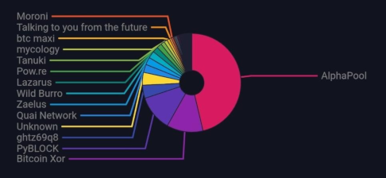

# Contiguous image in a validating Knots node

On the Knots Discord on 2026-09-28 I was asked to show how any BIP110 compatible format can store more than 256 bytes contiguously in RAM. This is the answer, in its second version. The first version fed the transaction in over RPC and read memory after RPC calls that serialize it, so most of the whole-file copies it counted were the demo's own doing. That criticism was correct. This version feeds the transaction in over P2P, as mainnet does, and reads memory before any RPC that serializes it has run.

The witness script. BIP110 caps pushes and stack items at 256 bytes, not the P2WSH script that holds them. A Knots node validating `23e8f9466cd895c21a041155dba377f1a77a46cec13dcb14c430fa9c75f8786a` (block 969961) under the fork rules holds each of its 25 witness scripts whole in the mempool, 1,546 bytes each, and holds the whole 37,975-byte JPEG XL file in the buffers it receives, relays and serves the transaction and the block with. `ram_demo.py` reads it out of the node's `/proc/<pid>/mem` and `djxl` renders it.



## What the script does

1. Starts one node from the official Knots 29.4.2 binary on regtest with the BLAKE2b fork, and so RDTS/BIP110, active from height 100, and the Knots default relay policy on (`-corepolicy=0`).
2. Connects two peers that never request anything on their own. The first sends the funding transaction and then the spend as `tx` messages. The 25 witness scripts are the mainnet ones; no signatures exist; each script is `OP_1 OP_NOTIF <data> OP_ENDIF OP_1`.
3. Reads the node's memory three times: once the spend is in the mempool and nothing has serialized it (membership is checked with `getrawmempool`, which returns ids), after the second peer fetches the transaction with `getdata`, and after the block is mined and the second peer fetches the block. The second peer keeps every byte the node sends it, as it came off the socket.
4. Checks the node enforces the cap on this shape: a 256-byte push is accepted, a 257-byte push is rejected.
5. Renders the bytes read out of the node's memory.

## Result

```
mainnet witness scripts: 25, sizes [775, 1546]
node /Satoshi:29.4.2(testnode0)/Knots:20260508/, height 120, fork at 100, node args: ['-testactivationheight=blake2b@100', '-rdtsexpiry=2000000000', '-corepolicy=0']
regtest tx ecd8e1ab52e3e4121046e4cee62778692c3c77c6506a268e574444098f52988f: 39059 bytes on the wire, JXL signature at byte 1084, tail of 37975 bytes == the mainnet file
accepted to the mempool from a tx message under Knots default policy + RDTS: vsize 10574
[1 in mempool, no serializing RPC yet] scanned 310 MiB of writable memory: witness script #1 (1,546 bytes) whole at 2 addresses (1 on its own, 1 inside a whole-file copy); complete 37,975-byte file at 1 addresses
peer fetched the tx: the tx message as it came off the socket carries the file whole at payload byte 1084
[2 after a peer fetched the tx] scanned 310 MiB of writable memory: witness script #1 (1,546 bytes) whole at 7 addresses (5 on its own, 2 inside a whole-file copy); complete 37,975-byte file at 2 addresses
mined in regtest block 122 (1a4673a9dd02969442e11b5dafa1960dad20016b908a7c3a49f01267c6903487)
peer fetched the block: the block message as it came off the socket carries the file whole at payload byte 1429
[3 after a peer fetched the block] scanned 311 MiB of writable memory: witness script #1 (1,546 bytes) whole at 9 addresses (6 on its own, 3 inside a whole-file copy); complete 37,975-byte file at 3 addresses
dead-branch push of 256 bytes: allowed=True
dead-branch push of 257 bytes: allowed=False mempool-script-verify-flag-failed (Push value size limit exceeded)
djxl on the bytes read from the node's memory: ['Decoded to pixels.', '486 x 224, 4.23 MP/s [4.23, 4.23], 1 reps, 12 threads.']
bytes read from bitcoind RAM == the file cut from the mainnet tx, byte for byte
```

What each whole-file copy is:

- After receipt over P2P, before any serializing RPC: one, the receive buffer the `tx` message landed in and the node deserialized from. The witness script is whole at two addresses: inside that buffer, and on its own in the mempool's transaction, where each input's witness script is one vector of 1,546 bytes.
- After a peer fetched the transaction: a second, the send buffer the node serialized the transaction into to answer the `getdata`. The peer's socket received the file whole at payload byte 1084 of the `tx` message.
- After a peer fetched the block: a third, the raw block the node read from `blk*.dat` into one buffer to answer the block `getdata` (`ReadRawBlock` in `net_processing.cpp`, the fast path that serves the on-disk bytes as the wire format). The peer received the file whole at payload byte 1429 of the `block` message.

These are the buffers every node uses to receive, relay and serve the transaction and the block. None comes from an RPC call: the only RPCs before the reads are `generatetoaddress`, `getrawmempool` and `getmempoolentry`. The deserialized transaction itself holds the image as 25 separate vectors, one per input, each a contiguous run of 1,542 image bytes. The counts of the script on its own rise with validation and relay (copies the interpreter and the relay path made and freed) and move a little between runs with heap layout; the whole-file counts were 1, 2 and 3 in every run.

## Why the cap does not reach it

The 256-byte limit is checked on every push the interpreter reads, executed or not (the `max_element_size` check in `EvalScript`, `src/script/interpreter.cpp`), and on every witness stack item after the script has been popped off the stack. The script itself is one byte array, bounded by 3,600 bytes under standard policy and 10,000 under consensus, and RDTS left both alone.

Inside the script the image sits in 255-byte pushes with a 2-byte PUSHDATA1 header between them. The encoder wrapped each header in a JPEG XL `free` box, the padding box the container standard defines, and an 18-byte one across each input boundary. The framing bytes are part of the file, so nothing is reassembled. No stack item over 256 bytes exists anywhere in the transaction; the dead branch never executes, so its pushes never become stack items at all.

## On disk too

`carve.sh` needs no node. It fetches the raw transaction and the raw block from mempool.guide, cuts the file out with `tail -c`, and renders it with `djxl` from both. Block 969961 carries the file at offset 43022, and `djxl` decodes it from there with the following transactions still attached. That is the block as the node sends it to any peer that asks for it. On disk, a datadir created with Knots or Core 28.0 or later writes `blk*.dat` XORed with the 8-byte key kept beside it in `blocks/xor.dat`; a datadir older than that has a zero key and holds the bytes as they are.

## Run it

Needs the functional test framework from a Bitcoin Knots 29.4.2 source tree with a build (`build/test/config.ini`), a `bitcoind` to test, and `djxl` from libjxl-tools. The log above used the official 29.4.2 release binary through `BITCOIND`; without it the framework runs the tree's own build. The raw transaction is fetched from mempool.guide on first run.

```
BITCOIND=/path/to/bitcoind PYTHONPATH=<knots>/test/functional python3 ram_demo.py --configfile <knots>/build/test/config.ini
```

The memory read works because the test framework is bitcoind's parent process, which the default `ptrace_scope=1` allows.
